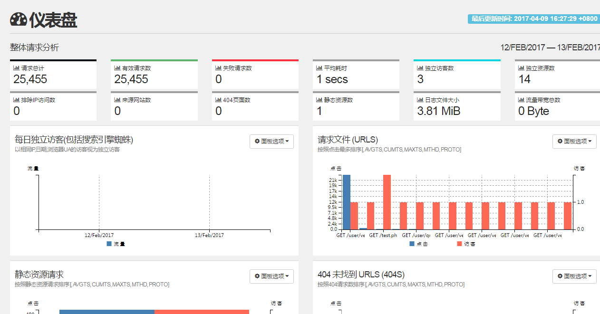

GoAccess 中文版，此中文版基于官方 goaccess 1.2 版本汉化，绝对原汁原味。如有翻译瑕疵，可以联系我们 typefo@qq.com 或者 736589354@qq.com

### GoAccess 中文界面



### GoAccess 安装方法

编译安装之前需要安装 geoip 开发包，下载地址 https://github.com/maxmind/geoip-api-c

```
$ yum install -y git
$ git clone https://github.com/wylbjia/goaccess.git
$ cd goaccess-1.2
$ ./configure --enable-utf8 --enable-geoip=legacy
$ make
$ make install
```

